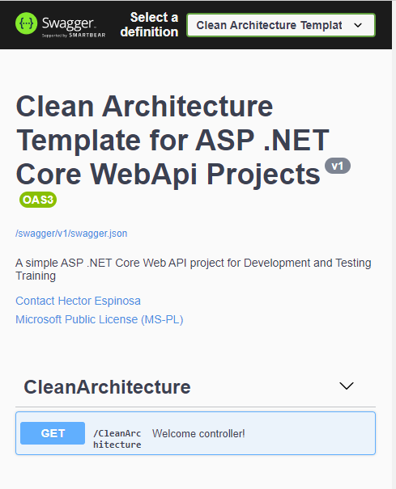

# Clean Architecture Template 
The following solution template can be used for creating C# ASP .NET Core WebAPI using Clean Architecture Design Pattern Principles.

## Frameworks, tools and techologies used
1. [ASP .NET Core 3.1](https://dotnet.microsoft.com/download/dotnet/3.1)
1. [MediatR](https://github.com/jbogard/MediatR)
1. [FluentValidation](https://fluentvalidation.net/)
1. [FluentAssertions](https://fluentassertions.com/)
1. [Moq](https://github.com/Moq)
1. [Docker](https://www.docker.com/)
1. [Lorem.Universal.NET](https://github.com/trichards57/Lorem.Universal.NET)
1. [Newtonsoft.Json](https://www.newtonsoft.com/json)
1. [xUnit](https://github.com/xunit/xunit)
1. [Swashbuckle.AspNetCore](https://github.com/domaindrivendev/Swashbuckle.AspNetCore)

# Getting Started
1. Install [Visual Studio](https://visualstudio.microsoft.com/)
1. Install the latest [.NET 5 SDK](https://dotnet.microsoft.com/download/dotnet/5.0) | [.NET 6 SDK](https://dotnet.microsoft.com/en-us/download/dotnet/6.0)
1. Install [.Net Core 3.1 SDK](https://dotnet.microsoft.com/download/dotnet/3.1).

## Local Installation
1. Clone this repository in your computer in a local `<DIRECTORY>` (`e.g.: C:\Users\hack3rlife\source\repos`).
1. Install the template by running the following command: `dotnet new <DIRECTORY>`.
1. Create a new directory (`e.g.: hack3rlife-cleanarchitecture`) and `cd` into it.
1. Create a new solution by executing the following command `dotnet new -i CleanArchitectureNetCoreWebAPI -n <PROJECT_NAME>`.

## NuGet Installation
1. Execute `dotnet new -i Hack3rlife.ASP.NETCore.WebAPI` to install the latest version.
    1.  Execute `dotnet new -u Hack3rlife.ASP.NETCore.WebAPI` to uninstall the template.

# How the code is organized
The solution is organized in the following way

    - BlogWebApi.WebApi.sln

        | - README.md

        | - src

            | - BlogWebApi.Application

            | - BlogWebApi.Domain

            | - BlogWebApi.Infrastructure

            |- BlogWebApi.WebApi

        | - tests

            | - Application.UnitTest

            | - Infrastructure.IntegrationTests

            | - WebApi.EndToEndTests

## Domain Project
This project will include Domain Models, Interfaces that will be implemented by the outside layers, enums, etc., specific to the domain logic.  This project should not have any dependecy to another project since it is the core of the project.

### Domain Types
* Domain Models 
* Interfaces
* Exceptions
* Enums

### Application Project
This project will contain the application logic. The only dependency that should have is the Domain project. Any other project dependency must be removed.

### Appllication Types
* Exceptions
* Interfaces
* DTOs
* Mappers

### Infrastructure Project
The Infrastructure project generally includes data access implementations or accessing external resources as file sytems, SMTP, third-party services, etc.  These classes should implementations of the Interfaces defined in the Domain Project.  Therefore, the only dependency in this project should be to the Domain Project.  Any other dependency must be removed.

### Infrastructure Types
* EF Core Types
* Repository Implementation

### WebAPI Project
This is the entry point of our application and it depends on the Application and Infrastrucre projects.  The dependency on Infrastructre Project is requiered to support Dependency Injection in the `Startup.cs` class.  Therefore, no direct instantiation of or static calls to the Infrastucture project should be allowed.

### WebAPI Types
* Controllers
* Startup
* Program 

# References
* https://docs.microsoft.com/en-us/dotnet/core/tools/custom-templates
* https://docs.microsoft.com/en-us/dotnet/architecture/modern-web-apps-azure/common-web-application-architectures