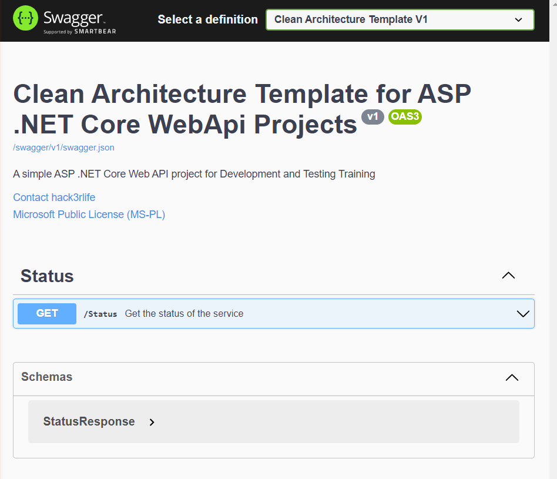

# Clean Architecture Template 
The following solution template can be used for creating C# ASP .NET Core WebAPI using Clean Architecture Design Pattern Principles.

# Getting Started
1. Install the latest [.NET 5 SDK](https://dotnet.microsoft.com/download/dotnet/5.0).
2. Install [.Net Core 3.1 SDK](https://dotnet.microsoft.com/download/dotnet/3.1).
3. Clone this repository in your computer in a local `<DIRECTORY>` (`e.g.: C:\Users\hack3rlife\source\repos`)
4. Install the template by running the following command: `dotnet new <DIRECTORY>` 
5. Create a new directory (`e.g.: hack3rlife.cleanarchitecture`) and `cd` into it.
6. Create a new solution by executing the following command `dotnet new CleanArchitectureNetCoreWebAPI`

# Frameworks, tools and techologies used
1. [ASP .NET Core 3.1](https://dotnet.microsoft.com/download/dotnet/3.1)
2. [MediatR](https://github.com/jbogard/MediatR)
3. [FluentValidation](https://fluentvalidation.net/)
4. [FluentAssertions](https://fluentassertions.com/)
5. [Moq](https://github.com/Moq)
6. [Docker](https://www.docker.com/)
7. [Lorem.Universal.NET](https://github.com/trichards57/Lorem.Universal.NET)
8. [Newtonsoft.Json](https://www.newtonsoft.com/json)
9. [xUnit](https://github.com/xunit/xunit)
10. [Swashbuckle.AspNetCore](https://github.com/domaindrivendev/Swashbuckle.AspNetCore)

# References
* https://docs.microsoft.com/en-us/dotnet/core/tools/custom-templates
* https://docs.microsoft.com/en-us/dotnet/architecture/modern-web-apps-azure/common-web-application-architectures